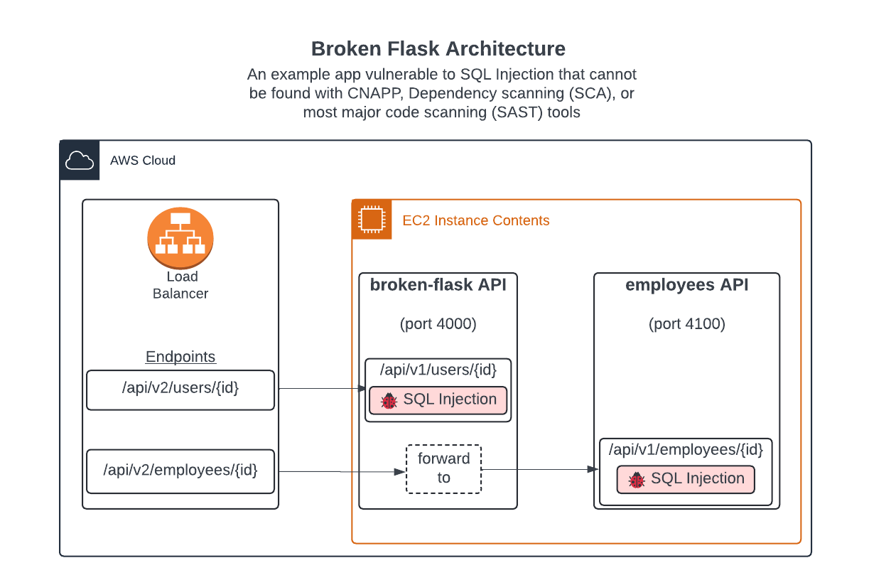

# Broken Flask

A simple REST API that demonstrates the limitations of current security tools like SAST, DAST, and CNAPP tools.

These findings are **not** discoverable through SAST/code review tools like Semgrep, Bandit, or CodeQL. They are not discoverable through CNAPP/CSPM tools like Wiz, Palo Alto Prisma Cloud, Checkov, or Prowler. They are **only** discoverable through **dynamic analysis** - when you actually simulate an attack against the live application.

The findings are also **not** discoverable through other Dynamic Application Security Testing (DAST) and API Security tools because the API is undocumented and those DAST tools do not understand how to communicate with the API. This affects roughly 80% of REST APIs, so roughly 80% of APIs are not testable with other DAST tools.

Here's the API: https://flask.brokenlol.com/



# Motivation

**Why did I create this?** Unfortunately, the security industry has been heavily focused on "known vulnerabilities" that are not exploitable - whether that's CVEs or cloud misconfigurations. This isn't the fault of engineers or founders in those industries - it's a narrative and culture that's pushed by VCs and vendors with big marketing budgets. As a result, many people in the industry are left thinking that known vulnerabilities in third party or OSS software are the only things that matter. This is not true.

The Application Security industry as a subset is also heavily focused on SAST - which is known to generate a ton of noise. Over 99% of SAST findings do not result in an exploitable security vulnerability. And many times, like in this Broken Flask app, many SAST tools don't even find the vulnerability because it's a game of writing rules in whack-a-mole fashion. _This is not to say that SAST is not useful_ - it is. But it's not the only thing that matters.

_The **only** thing that matters is **exploitability**_. If a 3rd party package or SAST finding exists in your codebase, and it's not exploitable, does it matter? **No**. It doesn't.

# Comparison

> [!NOTE]
> Disclaimer: We've created a product that can auto-document those APIs and test them with dynamic scanning to fill this gap. If you're interested in learning more, please reach out to me at kinnaird@nightvision.net. `</end advertisement>`

| Category         | Tool                   | SQL Injection - Frontend API | SQLi - Backend API |
|------------------|------------------------|------------------------------|--------------------|
| Code-Aware DAST  | NightVision            | ✅                            | ✅                  |
| SAST             | CodeQL                 | ✅                            | ❌                  |
| SAST             | Coverity               | ❌                            | ❌                  |
| SAST             | Semgrep                | ❌                            | ❌                  |
| DAST             | Bright Security        | ❌                            | ❌                  |
| DAST             | StackHawk              | ❌                            | ❌                  |
| DAST             | ZAP OSS                | ❌                            | ❌                  |
| Dependency Scans | Dependabot             | ❌                            | ❌                  |
| Dependency Scans | Snyk                   | ❌                            | ❌                  |
| Infra-as-Code    | Checkov                | ❌                            | ❌                  |
| Infra-as-Code    | tfsec                  | ❌                            | ❌                  |
| CSPM             | Palo Alto Prisma Cloud | ❌                            | ❌                  |
| CSPM             | Prowler                | ❌                            | ❌                  |
| CSPM             | Wiz                    | ❌                            | ❌                  |

# Getting Started

## Local Setup

This setup will work for scanning with SAST, IaC, Dependency scanning tools, and DAST tools like NightVision or ZAP.

* Run these commands to start the app:

```bash
# Build the docker image
docker-compose build
# Run the docker image
docker-compose up -d
```

### SAST and SCA scans

* Run these commands to perform scans with SAST (code scanning tools).

```bash
# Run Semgrep (SAST)
make semgrep
# Run Bandit (SAST)
make bandit
```

> [!NOTE]
> **Why can't my code review tool (Semgrep, Bandit, CodeQL, etc.) find these vulnerabilities?**
> 
> Static Application Security Testing (SAST) tools work by scanning the codebase for known patterns that are indicative of security vulnerabilities. These tools are not able to identify vulnerabilities that are only exploitable in a live environment.
>
> That's not to say that SAST tools are not useful - they are, and they can help find these unknown vulnerabilities, unlike the other classes of tools here. But they can't find everything, mainly:
> * Vulnerabilities that are only exploitable in a live environment (there are a lot of these!)
> * Run-time and environment related issues
> * Nuanced access control issues
> * Business logic issues
> 
> Additionally, some SAST tools have difficulty scanning code that lives across multiple files (Semgrep OSS), and others have a deficiency of rules (Bandit, other vendors that will threaten legal action if I offend them).

### Dependency analysis scans

* Run these commands to perform scans with Dependency Scanning tools:

```bash
# Run Snyk (Dependency analysis)
make snyk
```

### DAST Scans

#### NightVision

* If you have access to [NightVision](https://app.nightvision.net), you can run a DAST scan in a few minutes:

```bash
# Create the target
nightvision target create \
  --name broken-flask-local \ 
  --url http://localhost:4000 \
  --type api

# Generate a Swagger doc from analyzing code
nightvision swagger extract \
  --target broken-flask-local \
  --output openapi.yml \
  --lang python \
  ./flask_app

# Run the scan
nightvision scan --target broken-flask-local
```

NightVision **will** discover SQL Injection in the application.

#### ZAP

ZAP, formerly known as OWASP ZAP, is a free and open-source web application and API security scanner.

* Run this command to perform a scan with ZAP (DAST):

```bash
# Run ZAP (DAST)
make zap
```

ZAP will not find the SQL Injection vulnerability in the application because it does not have access to the Swagger documentation. Other DAST tools on the market (besides NightVision) are in the same boat.

## AWS Setup

This setup will deploy the application to AWS to demonstrate that the vulnerabilities cannot be found with CNAPP/CSPM tools like Wiz, Palo Alto Prisma Cloud, or Prowler.

* Run the following commands to deploy the application to AWS:

```bash
cd terraform
terraform init
terraform plan
terraform apply -auto-approve
```

### Scanning with Infrastructure as Code (IAC) tools

* Run these commands to perform scans with IaC tools. There are zero results.

```bash
# Run Checkov (IaC)
make checkov
# Run tfsec
make tfsec
```

> [!NOTE]
> **Why can't my IAC scanning tool (Checkov, Tfsec, etc.) find these vulnerabilities?**
> IaC scanning tools are not designed to cover application code (in this case, the Python code). It only focuses on misconfigurations, like open S3 buckets, security groups, etc.

### Scanning with Cloud Misconfiguration/CSPM/CNAPP tools

* Run these commands to perform scans with free CNAPP/CSPM tools. There are zero results.

```bash
pipx install prowler
```

> [!NOTE]
> Prowler is actually awesome. Toni has created a pretty sweet product, and you should try it: https://prowler.com/

* For paid CNAPP/CSPM tools, you can try to scan the application with Wiz or Palo Alto Prisma Cloud after deploying the application to AWS. 

We are a small startup and can't afford these tools, but I've had some friends run these tools against this application, and they were unable to find the vulnerabilities.

> [!NOTE]
> **Why can't my CNAPP/CSPM Tool (Wiz, Palo Alto, Prowler, etc.) find these vulnerabilities?**
> **In general**:
> 
> CNAPP tools work by taking an EBS snapshot of the target EC2 instance, copying the snapshot to their account, mounting it to an EC2 as a disk, and scanning the disk for CVEs and vulnerabilities.
> 
> By function of how those tools work, they will not be able to identify the vulnerabilities in this application because this app has vulnerabilities **in the application code, not in the OS or packages**.
> 
> **Specifically for this application**:
> CNAPP tools don't currently test for vulnerabilities in the application code. They are focused on misconfigurations, CVEs, and toxic combinations.

> [!TIP]
> If you're a CNAPP provider, we have a partner program that will help you provide this type of wide-ranging coverage. Please reach out to me at kinnaird@nightvision.net if you're interested.

# FAQ

## I'm skeptical. Is this a niche case?

No. These are standard vulnerability classes that are exploited in the wild - SQL Injection, Server Side Request Forgery, and Remote Code Execution. 

This is an insanely simple application. Just take a look at [src/app.py](flask_app/app.py) - it's 50 lines of application code, plus infrastructure code in the [terraform](terraform) directory.

## How do I install these tools?

You can visit the following links for instructions on how to install the various scanning tools:
* [Snyk CLI](https://docs.snyk.io/snyk-cli/getting-started-with-the-snyk-cli)
* [Semgrep](https://semgrep.dev/docs/getting-started/quickstart)
* [Bandit](https://bandit.readthedocs.io/en/latest/start.html)

## Quick Install for Mac users

If you are on Mac, you should have homebrew installed. You should also have pipx installed if you haven't used it already. It's amazing. See [pipx installation instructions](https://pipx.pypa.io/stable/installation/).

If you have those installed, you can run the following to install all these tools:

```bash
# Suggested 
pipx install semgrep
pipx install bandit 
pipx install checkov

# These only have homebrew or direct download options. Use these commands
brew install tfsec
brew tap snyk/tap
brew install snyk
```

# References

Mitre attack:
* Active Scanning (T1595)
* Vulnerability Scanning (T1595.002): https://attack.mitre.org/techniques/T1595/002/
