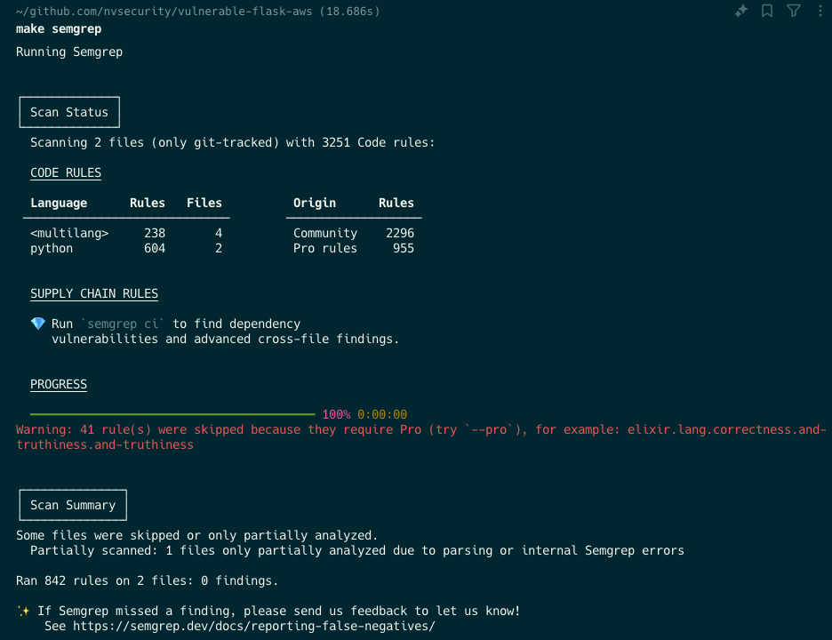
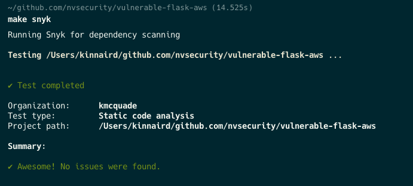

# SAST Tools

## Semgrep

## CodeQL

## Bandit

# Dependency Scanning Tools

## Snyk

# CNAPP/CSPM Tools

## Wiz

* Pay 250k for a license
* Set it up on an empty cloud account
* Guaranteed you'll see no findings related to SQL Injection, Server Side Request Forgery, or Remote Code Execution.

## Palo Alto Prisma Cloud

# Infrastructure as Code Tools
